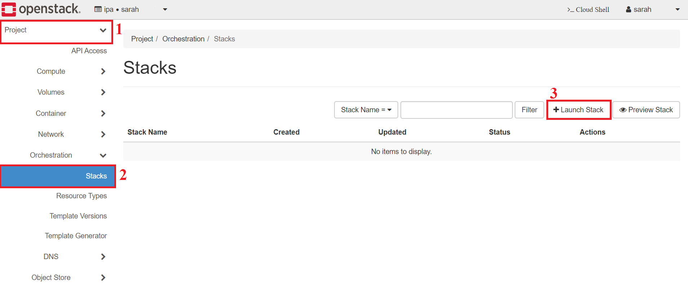
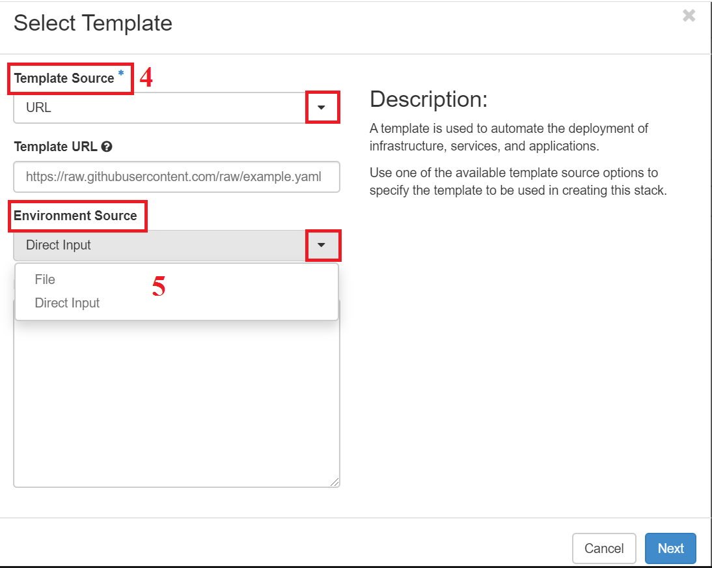
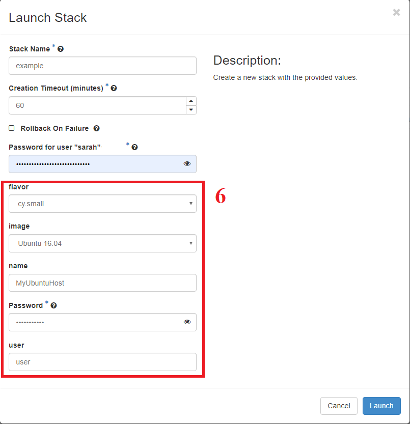
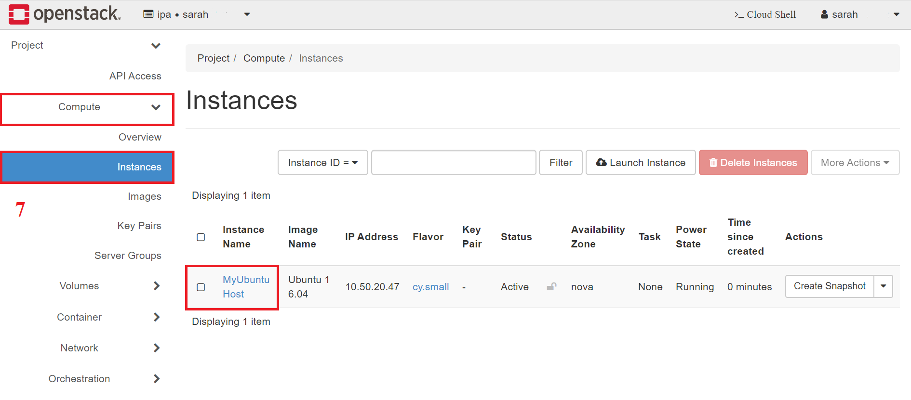
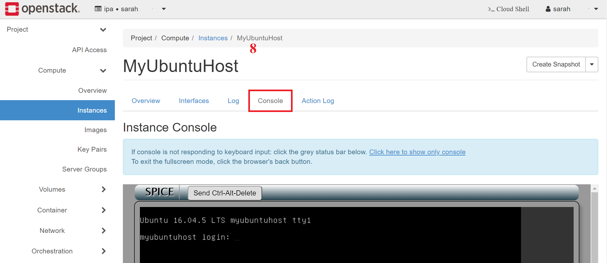

Getting Started (with Horizon)
==============================

Assuming you will first be interacting with Openstack through a web browser, you
can access the canonical based dashboard through “Horizon”. 

To reach the dashboard for the Beta/Experimental Range for the Georgia Cyber Center, visit:
(https://dashboard.gacyberrange.org)

If you have requested and been issues an account, you may use your login and password. The domain field will be filled in with "default".

To request an account, contact: cybertraining@augusta.edu

You will be required to sign and return a EULA and adhere to the standards set within while using the range.

Once you've logged in
======================

Interactions with the OpenStack cloud environment will be done within your “project”. 

Your project is the area where you are able to deploy and interact with the resources allocated to
you. You may have access to one, or more projects; additionally, multiple
individuals work within a single project. 

_Familiarizing yourself with the menu
options available on the left hand side of the browser is important._

[1.]  Under your Project tab, you will find everything you need to deploy and
    access your stack.

[2.]  Expanding the orchestration tab, you will see the option for “Stacks”. *This
    is where you will deploy templates.*

[3.]  You will hit the “+ Launch Stack” button.

[4.]  You may provide a file located on your local machine, a URL, or direct
    input. The URL may point to a code repository, but ensure you use the “raw”
    URL, and not the HTML rendered view as when you browse to the file.

[5.]  If using an environment file, this is selected in the same way, at the same
    tab as the template file with the options of file or direct input.

[6.]  Provide any parameters required, or change parameter options as needed.

[7.]  Expanding the compute tab, you will see the option for “instances”. This is
    where you can access the console for any of the instances you deploy in your
    stack. Click on the instance name, which opens a new view.

[8.]  From this instance view you will see a “Console” tab. This is where you can
    access the GUI/CLI of the instance OS.

Want to give the Client a try?
==============================

<https://docs.openstack.org/newton/user-guide/common/cli-install-openstack-command-line-clients.html>

-   If using Linux, source the openrc.sh file in your terminal as indicated in
    the instructions.

-   If using Windows, create environment variables for all items within the
    openrc.sh file; you can use the client through PowerShell. for example, you would create an environment variable for OS_USERNAME, and set the value to the account username you authenticate to the cloud with.
